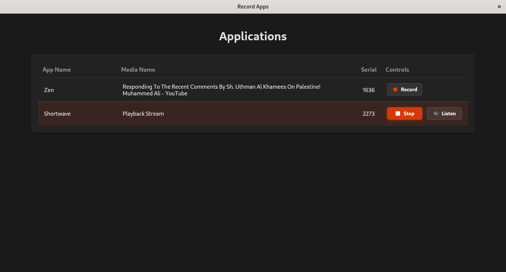

# Record Apps

A desktop application that allows you to record audio from specific applications
on Linux. Built with Deno, Svelte, and WebView.



<a href='https://flathub.org/apps/io.github.sigmasd.recordapps'>
  
</a>

## Features

- List running applications with audio output
- Record audio from specific applications
- Record audio from different outputs of a specific applications
- Save recordings automatically to your Music directory

## Prerequisites

- Linux operating system
- PulseAudio/PipeWire audio system
- Deno runtime installed
- `pactl` command-line utility

## Installation

1. Clone the repository:

```bash
git clone <repository-url>
cd record
```

2. Build the application:

```bash
deno task compile
```

This will create an executable named `record` in the project root directory.

3. Run the application:

```bash
./record
```

## Project Structure

```
├── distro/                      # Packaging and distribution files (Flatpak, icons, manifests)
├── src/
│   ├── backend/                 # Core audio and backend logic
│   │   ├── lib.ts, lib.test.ts
│   │   └── server.ts
│   ├── dist/                    # Built frontend assets and server
│   │   ├── build/
│   │   └── front-server.ts
│   ├── frontend/                # Svelte frontend app
│   └── webview/                 # WebView (main app entry)
```

## How It Works

1. The application creates virtual audio sinks for each application being
   recorded
2. Audio is redirected from the original application to its dedicated virtual
   sink
3. The virtual sink's audio is recorded to a FLAC file
4. Recordings are saved in `~/Music/RecordApps/<app-name>/` with timestamp-based
   filenames

## License

MIT
